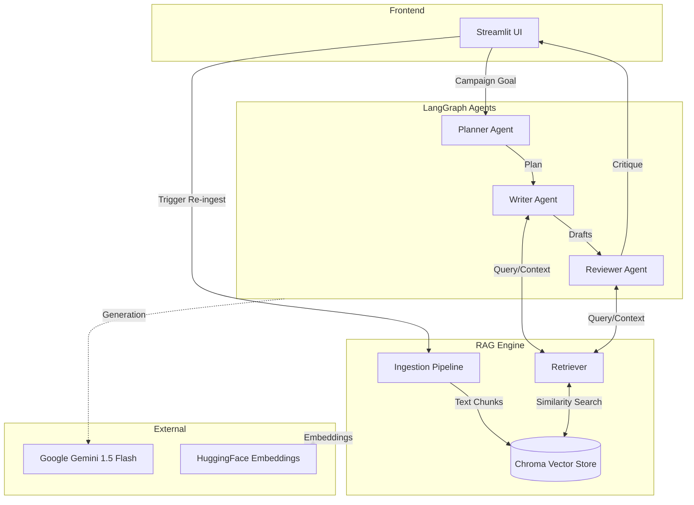

# 🚀 Marketing Campaign Orchestrator
An intelligent, agentic AI application that automates the creation of marketing campaigns. It uses **LangGraph** to orchestrate a team of AI agents that plan, write, and review marketing assets, grounded in your company's knowledge base using **RAG** (Retrieval-Augmented Generation).
## ✨ Features
*   **Strategic Planning:** Automatically determines the best assets (emails, posts, blogs) for your campaign goal.
*   **RAG-Powered Drafting:** Writes content using your actual product documentation and brand history.
*   **Brand Compliance:** A dedicated agent reviews all content against your brand guidelines to ensure consistency.
*   **Interactive UI:** Built with **Streamlit** for easy interaction and configuration.

## Screenshots


## 🛠️ Architecture
The system is built on a **StateGraph** workflow and a **RAG** engine.



1.  **User Input:** Defines the campaign goal.
2.  **Planner Agent:** Decides what to build.
3.  **Writer Agent:** Generates drafts using RAG (retrieving context via HuggingFace embeddings).
4.  **Reviewer Agent:** Critiques drafts against brand rules.

See [agents.md](./agents.md) for detailed agent specifications.
See [rag_architecture.md](./rag_architecture.md) for detailed RAG architecture flows.
## 📂 Project Structure
*   `app.py`: Main Streamlit application entry point.
*   `src/agents.py`: Definitions of the Planner, Writer, and Reviewer agents and the LangGraph workflow.
*   `src/rag.py`: RAG implementation (Ingestion and Retrieval) using ChromaDB and HuggingFace Embeddings.
*   `data/`: Directory for knowledge base text files (brand guidelines, product docs).
*   `requirements.txt`: Python dependencies.
## 🚀 Getting Started
### Prerequisites
*   Python 3.10+
*   Google API Key (Gemini)
### Installation
1.  **Clone the repository** (if applicable).
2.  **Install dependencies:**
    ```bash
    pip install -r requirements.txt
    ```
3.  **Set up Knowledge Base:**
    *   Place your text documents (e.g., `brand_guidelines.txt`, `product_info.txt`) inside the `data/` folder.
### Running the App
1.  **Start the Streamlit server:**
    ```bash
    streamlit run app.py
    ```
2.  **Configure:**
    *   Enter your Google API Key in the sidebar.
    *   Click **"Re-ingest Knowledge Base"** to load your documents into the vector store.
3.  **Run a Campaign:**
    *   Enter a goal (e.g., *"Promote our new eco-friendly sneaker launch on Instagram"*).
    *   Click **"Run Campaign"**.
## 🧩 Technologies
*   **LangChain & LangGraph**: Agent orchestration.
*   **Streamlit**: User Interface.
*   **ChromaDB**: Vector Database for RAG.

*   **Google Gemini**: LLM (Gemini 1.5 Flash).
*   **Hugging Face**: Embeddings (all-MiniLM-L6-v2).

