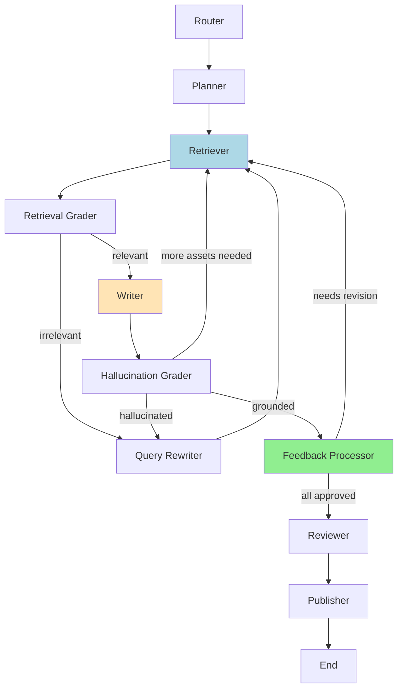
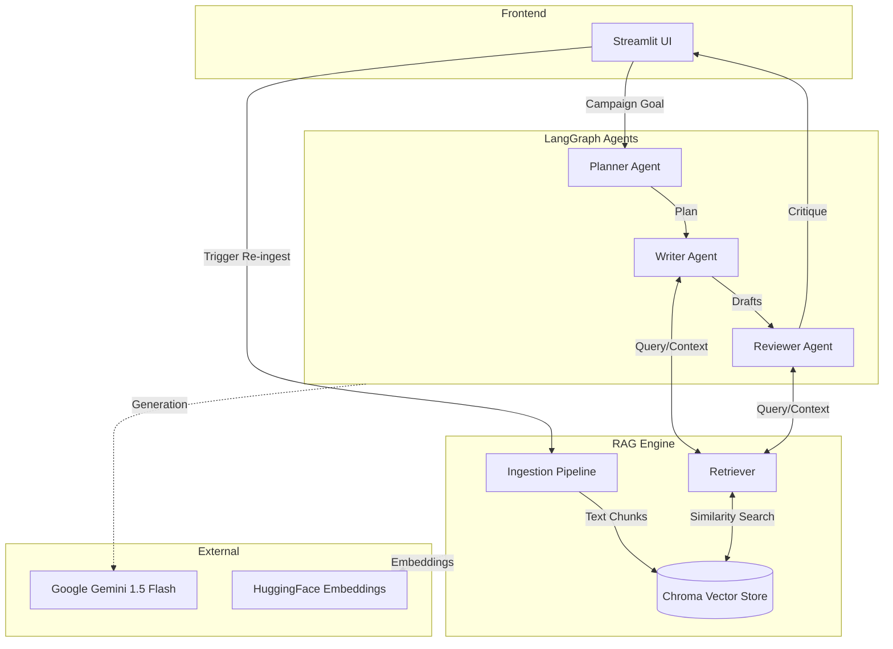

# 🚀 Marketing Campaign Orchestrator
An intelligent, agentic AI application that automates the creation of marketing campaigns. It uses **LangGraph** to orchestrate a team of AI agents that plan, write, and review marketing assets, grounded in your company's knowledge base using **RAG** (Retrieval-Augmented Generation).

## ✨ Features
*   **Strategic Planning:** Automatically determines the best assets (emails, posts, blogs) for your campaign goal.
*   **RAG-Powered Drafting:** Writes content using your actual product documentation and brand history.
*   **Human-in-the-Loop:** Review and provide feedback on drafts before finalization, with iterative regeneration based on your input.
*   **Brand Compliance:** A dedicated agent reviews all content against your brand guidelines to ensure consistency.
*   **MCP Integration:** Direct Google Docs integration using Model Context Protocol for seamless third-party integrations.
*   **Interactive UI:** Built with **Streamlit** for easy interaction and configuration.
## 🛠️ Architecture
The system is built on a **StateGraph** workflow and a **RAG** engine.

## Complete Agent Workflow with Human-in-the-Loop

The following diagram shows the full agent workflow including the new **Feedback Processor** node for human-in-the-loop functionality:



**Workflow Nodes:**
- **Router**: Classifies user intent (marketing campaign vs chitchat)
- **Planner**: Determines which marketing assets to create
- **Retriever**: Fetches relevant context from knowledge base (RAG)
- **Retrieval Grader**: Validates relevance of retrieved documents
- **Writer**: Generates content using RAG-retrieved context
- **Hallucination Grader**: Ensures content is grounded in retrieved context
- **Feedback Processor** ⭐ NEW ⭐: Handles human feedback and triggers regeneration
- **Reviewer**: Checks brand compliance against guidelines
- **Publisher**: Creates Google Docs and schedules calendar events

**Human-in-the-Loop**: The workflow pauses at the Feedback Processor, allowing users to review drafts, provide feedback, and request revisions. Rejected drafts are regenerated incorporating user feedback.



1.  **User Input:** Defines the campaign goal.
2.  **Planner Agent:** Decides what to build.
3.  **Writer Agent:** Generates drafts using RAG (retrieving context via HuggingFace embeddings).
4.  **Reviewer Agent:** Critiques drafts against brand rules.

See [agents.md](./agents.md) for detailed agent specifications.
See [rag_architecture.md](./rag_architecture.md) for detailed RAG architecture flows.
## 📂 Project Structure
*   `app.py`: Main Streamlit application entry point.
*   `src/agents.py`: Definitions of the Planner, Writer, and Reviewer agents and the LangGraph workflow.
*   `src/rag.py`: RAG implementation (Ingestion and Retrieval) using ChromaDB and HuggingFace Embeddings.
*   `data/`: Directory for knowledge base text files (brand guidelines, product docs).
*   `requirements.txt`: Python dependencies.
## 🚀 Getting Started
### Prerequisites
*   Python 3.10+
*   Google API Key (Gemini)
### Installation
1.  **Clone the repository** (if applicable).
2.  **Install dependencies:**
    ```bash
    pip install -r requirements.txt
    ```
3.  **Set up Knowledge Base:**
    *   Place your text documents (e.g., `brand_guidelines.txt`, `product_info.txt`) inside the `data/` folder.
### Running the App
1.  **Start the Streamlit server:**
    ```bash
    streamlit run app.py
    ```
2.  **Configure:**
    *   Enter your Google API Key in the sidebar.
    *   Click **"Re-ingest Knowledge Base"** to load your documents into the vector store.
3.  **Run a Campaign:**
    *   Enter a goal (e.g., *"Promote our new eco-friendly sneaker launch on Instagram"*).
    *   Click **"🚀 Start Campaign"**.
    *   **Review the plan** and approve to continue.
    *   **Review drafts** - the app will pause for your feedback.
    *   **Provide feedback** - Approve drafts or request revisions with specific instructions.
    *   **Final review** - Review compliance check before publishing.
    *   **Publish** - Drafts are published to Google Docs and scheduled in Calendar.

## 🔄 Human-in-the-Loop Feature

The application now includes an interactive feedback loop:

1. **Draft Review Stage**: After content generation, you can review each draft individually
2. **Approve or Request Revisions**: For each draft, you can:
   - ✅ **Approve** - Accept the draft as-is
   - 🔄 **Request Revision** - Provide specific feedback for regeneration
3. **Iterative Refinement**: Rejected drafts are regenerated incorporating your feedback
4. **Bulk Actions**: Approve all drafts at once if satisfied
5. **Status Tracking**: See which drafts are approved, pending, or need revision

### Example Feedback
- "Make the tone more professional and formal"
- "Add statistics about market growth"
- "Include a call-to-action at the end"
- "Make it shorter and more concise"

## 🔌 MCP Server Integration

The application supports **Model Context Protocol (MCP)** for Google Docs integration:

### What is MCP?
MCP provides a standardized way to integrate external services. Instead of directly calling Google APIs, the app can use MCP servers for better:
- **Standardization**: Works across multiple services (Docs, Drive, Gmail, Slack, etc.)
- **Extensibility**: Easy to add new MCP servers
- **Separation of concerns**: Server handles auth and API details

### Setup MCP (Optional)
The application works without MCP (using direct Google API), but MCP provides enhanced integration:

1. **See detailed setup guide**: [docs/mcp_setup.md](docs/mcp_setup.md)
2. **Quick setup**:
   - Install Node.js
   - Set up Google Cloud OAuth credentials
   - Add credentials to `.env` file
   - MCP server auto-starts when needed

### Automatic Fallback
If MCP is not configured or fails, the app automatically falls back to direct Google API. No configuration required for basic functionality!
## 🧩 Technologies
*   **LangChain & LangGraph**: Agent orchestration.
*   **Streamlit**: User Interface.
*   **ChromaDB**: Vector Database for RAG.

*   **Google Gemini**: LLM (Gemini 1.5 Flash).
*   **Hugging Face**: Embeddings (all-MiniLM-L6-v2).

## Screenshots


