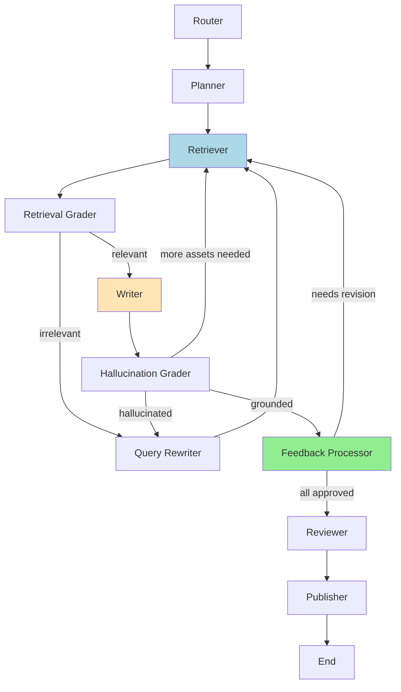
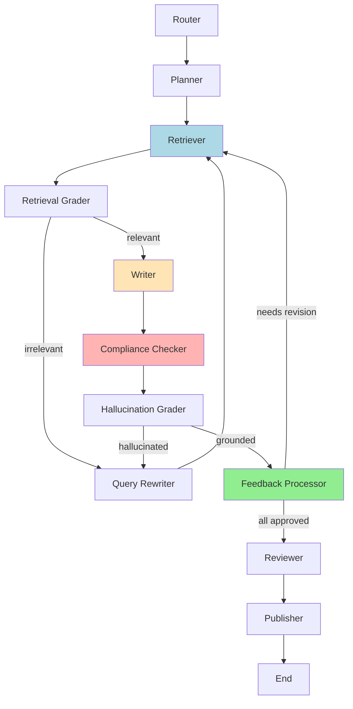

# 🚀 Wealthsimple Marketing Campaign Orchestrator

An intelligent, agentic AI application that automates the creation of marketing campaigns for Wealthsimple. It uses **LangGraph** to orchestrate a team of AI agents that plan, write, review, and publish marketing assets — grounded in Wealthsimple's real product knowledge base using **RAG** (Retrieval-Augmented Generation).

Built as a demonstration of AI-native marketing orchestration: replacing a 2-week, 5-person workflow with ~20 minutes and 3 human decisions.

## ✨ Features

- **Strategic Planning**: Automatically determines the best assets (emails, posts, blogs, press releases) for a campaign goal — with projected KPI benchmarks per asset type
- **RAG-Powered Drafting**: Writes content grounded in Wealthsimple product documentation, brand guidelines, and customer success stories
- **Audience Variant Generator**: Generates a primary draft and a complementary audience-segment variant for every asset
- **Compliance Checker**: Deterministic regex-based compliance gate (BLOCK / WARN / PASS) — checks for guaranteed-return language, missing disclaimers, competitor references, and unverified superlatives before human review
- **Human-in-the-Loop (HITL)**: Three explicit human decision points — plan approval, draft review with per-draft feedback, and final publish authorization
- **Brand Compliance Review**: A dedicated reviewer agent validates all content against Wealthsimple brand voice guidelines
- **Observability**: Full Langfuse tracing — per-node spans, retrieval metrics, guardrail results, and human feedback scores
- **MCP Integration**: Optional Google Docs integration via Model Context Protocol, with automatic fallback to direct Google API
- **Interactive UI**: Built with Streamlit — 5-stage guided workflow with progress tracker and human decision audit trail

## 🛠️ Architecture

The system is built on a LangGraph **StateGraph** workflow and a ChromaDB **RAG** engine.

## Complete Agent Workflow with Human-in-the-Loop

The following diagram shows the full agent workflow including the new **Feedback Processor** node for human-in-the-loop functionality:


```mermaid
graph TD
    Router[Router] --> Planner[Planner]
    Planner --> Retriever[Retriever]
    Retriever --> RetrievalGrader[Retrieval Grader]
    
    RetrievalGrader -->|relevant| Writer[Writer]
    RetrievalGrader -->|irrelevant| QueryRewriter[Query Rewriter]
    
    QueryRewriter --> Retriever
    
    Writer --> HallucinationGrader[Hallucination Grader]
    
    HallucinationGrader -->|grounded| FeedbackProcessor[Feedback Processor]
    HallucinationGrader -->|hallucinated| QueryRewriter
    HallucinationGrader -->|more assets needed| Retriever
    
    FeedbackProcessor -->|needs revision| Retriever
    FeedbackProcessor -->|all approved| Reviewer[Reviewer]
    
    Reviewer --> Publisher[Publisher]
    Publisher --> End[End]
    
    style FeedbackProcessor fill:#90EE90
    style Writer fill:#FFE4B5
    style Retriever fill:#ADD8E6
```

**Workflow Nodes:**
- **Router**: Classifies user intent (marketing campaign vs chitchat)
- **Planner**: Determines which marketing assets to create
- **Retriever**: Fetches relevant context from knowledge base (RAG)
- **Retrieval Grader**: Validates relevance of retrieved documents
- **Writer**: Generates content using RAG-retrieved context
- **Hallucination Grader**: Ensures content is grounded in retrieved context
- **Feedback Processor** ⭐ NEW ⭐: Handles human feedback and triggers regeneration
- **Reviewer**: Checks brand compliance against guidelines
- **Publisher**: Creates Google Docs and schedules calendar events

**Human-in-the-Loop**: The workflow pauses at the Feedback Processor, allowing users to review drafts, provide feedback, and request revisions. Rejected drafts are regenerated incorporating user feedback.


```mermaid
graph TD
    Router[Router] --> Planner[Planner]
    Planner --> Retriever[Retriever]
    Retriever --> RetrievalGrader[Retrieval Grader]

    RetrievalGrader -->|relevant| Writer[Writer]
    RetrievalGrader -->|irrelevant| QueryRewriter[Query Rewriter]
    QueryRewriter --> Retriever

    Writer --> ComplianceChecker[Compliance Checker]
    ComplianceChecker --> HallucinationGrader[Hallucination Grader]

    HallucinationGrader -->|grounded| FeedbackProcessor[Feedback Processor]
    HallucinationGrader -->|hallucinated| QueryRewriter

    FeedbackProcessor -->|needs revision| Retriever
    FeedbackProcessor -->|all approved| Reviewer[Reviewer]

    Reviewer --> Publisher[Publisher]
    Publisher --> End[End]

    style ComplianceChecker fill:#FFB3B3
    style FeedbackProcessor fill:#90EE90
    style Writer fill:#FFE4B5
    style Retriever fill:#ADD8E6
```

**Agent Nodes:**
1. **Router** — Classifies intent (Factual / Analytical / ChitChat / ClarificationNeeded)
2. **Planner** — Builds the asset plan + calls `CampaignPerformanceEstimatorTool` for KPI benchmarks
3. **Retriever** ⏸️ — Fetches context from the Wealthsimple knowledge base
4. **Retrieval Grader** — Validates document relevance; triggers Query Rewriter on failure
5. **Writer** — Generates primary draft + audience variant; CompetitorCheck guardrail applied
6. **Compliance Checker** — Deterministic regex scan: BLOCK / WARN / PASS; HIGH flags gate the UI Approve button
7. **Hallucination Grader** — Verifies the draft is grounded in retrieved facts
8. **Feedback Processor** ⏸️ — Routes revised drafts back to Retriever or forwards approved drafts to Reviewer
9. **Reviewer** — Brand voice and compliance review against Wealthsimple guidelines
10. **Publisher** ⏸️ — Creates Google Docs, schedules Calendar events

⏸️ = HITL interrupt point (`interrupt_before=["retriever", "feedback_processor", "publisher"]`)

See [rag_architecture.md](./rag_architecture.md) for detailed RAG architecture and flow diagrams.
See [agents.md](./agents.md) for detailed agent specifications.

## 📂 Project Structure

```
├── app.py                          # Streamlit frontend (5-stage HITL workflow)
├── backend.py                      # FastAPI REST API alternative
├── src/
│   ├── agents.py                   # LangGraph StateGraph + all agent nodes
│   ├── config.py                   # Model config, prompts, competitor list
│   ├── rag.py                      # ChromaDB ingestion + retrieval
│   ├── tools.py                    # LangChain tools (RAG, compliance, estimator)
│   ├── google_utils.py             # Google Docs + Calendar API helpers
│   ├── mcp_client.py               # MCP client for Google Docs integration
│   └── langfuse_integration.py     # Langfuse observability client + handlers
├── data/
│   ├── brand_guidelines.txt        # Wealthsimple brand voice + prohibited terms
│   ├── product_catalog.txt         # Wealthsimple Invest, Trade, Cash, Tax
│   ├── customer_success_stories.txt# Anonymised user persona case studies
│   └── compliance_guidelines.txt   # CIRO, OSC, CSA, FINTRAC, NI 31-103, CIPF
├── chroma_db/                      # Persisted ChromaDB vector store
├── docs/
│   ├── mcp_setup.md                # MCP integration setup guide
│   └── LANGFUSE_SETUP.md           # Langfuse observability setup guide
├── rag_architecture.md             # Detailed RAG + workflow architecture
├── agents.md                       # Agent specifications
└── requirements.txt
```

## 🚀 Getting Started

### Prerequisites
- Python 3.10+
- Google API Key (Gemini)

### Installation

1. **Clone the repository**
2. **Create a virtual environment and install dependencies:**
   ```bash
   python -m venv venv
   source venv/bin/activate  # Windows: venv\Scripts\activate
   pip install -r requirements.txt
   ```
3. **Configure environment variables** — copy `.env.example` to `.env` and fill in:
   ```
   GOOGLE_API_KEY=your_key_here
   LANGFUSE_PUBLIC_KEY=optional
   LANGFUSE_SECRET_KEY=optional
   ```

### Running the App

1. **Start Streamlit:**
   ```bash
   streamlit run app.py
   ```
2. **Configure:**
   - Enter your Google API Key in the sidebar
   - Click **"Re-ingest Knowledge Base"** to load Wealthsimple documents into the vector store
3. **Run a Campaign:**
   - Pick a quick-start template (Wealthsimple Invest / Trade / Cash / Tax Season) or use the Goal Builder
   - Click **"🚀 Start Campaign"**
   - **Stage 2 — Approve Plan:** Review the strategic plan and KPI benchmark table
   - **Stage 3 — Review Drafts:** Check compliance flags; view primary + variant tabs; acknowledge any HIGH flags
   - **Stage 3b — Feedback:** Approve each draft or request targeted revisions
   - **Stage 4 — Authorize Publish:** Final brand compliance review; export campaign brief or publish to Google Workspace

## 🔄 Human-in-the-Loop

Three decisions are always kept human:

| Decision Point | Why it stays human |
|---|---|
| ✅ Approve the strategic plan | Sets budget and resource direction |
| ✅ Approve / revise each content draft | Editorial judgment; compliance accountability |
| ✅ Authorize final publish to Google Workspace | Legal liability and reputational risk cannot be delegated to AI |

**Compliance Gate:** If a draft has HIGH-severity compliance flags (e.g., "guaranteed returns" language, missing financial disclaimer), the Approve button is disabled until you check an acknowledgement checkbox — creating an explicit, auditable record that a human reviewed the risk.

## 🛡️ Compliance & Guardrails

The Compliance Checker node runs deterministic regex checks (no LLM) on every draft:

| Severity | Behaviour | Example triggers |
|---|---|---|
| **BLOCK** (HIGH) | Approve button disabled until acknowledged | "guaranteed returns", "risk-free", missing disclaimer |
| **WARN** (MEDIUM) | Shown as warning; can publish with acknowledgement | Unsubstantiated %, missing CTA |
| **PASS** (LOW / none) | Green badge; no gate | Minor style notes |

Canadian regulatory coverage: **CIRO**, **OSC**, **CSA**, **FINTRAC**, **NI 31-103**, **CIPF**, **CASL**

## 📊 Observability (Langfuse)

When `LANGFUSE_PUBLIC_KEY` and `LANGFUSE_SECRET_KEY` are set:
- Every campaign run creates a trace with per-node spans
- Retrieval relevance scores and hallucination grades are tracked
- Human feedback decisions are logged as score events
- A live trace URL appears in the sidebar during a campaign run

See [docs/LANGFUSE_SETUP.md](docs/LANGFUSE_SETUP.md) for setup instructions.

## 🔌 MCP Integration (Optional)

The app supports **Model Context Protocol (MCP)** for Google Docs publishing. If not configured, it automatically falls back to direct Google API. See [docs/mcp_setup.md](docs/mcp_setup.md) for setup.

## 🧩 Technologies

| Layer | Technology |
|---|---|
| **LLM** | Google Gemini 2.5 Flash |
| **Embeddings** | HuggingFace `all-MiniLM-L6-v2` |
| **Vector DB** | ChromaDB (local persistence) |
| **Orchestration** | LangGraph `StateGraph` with HITL checkpointing |
| **Framework** | LangChain |
| **Frontend** | Streamlit |
| **Observability** | Langfuse |
| **Publishing** | Google Docs + Google Calendar API |
| **Guardrails** | Custom regex + Guardrails-AI |

## Screenshots


