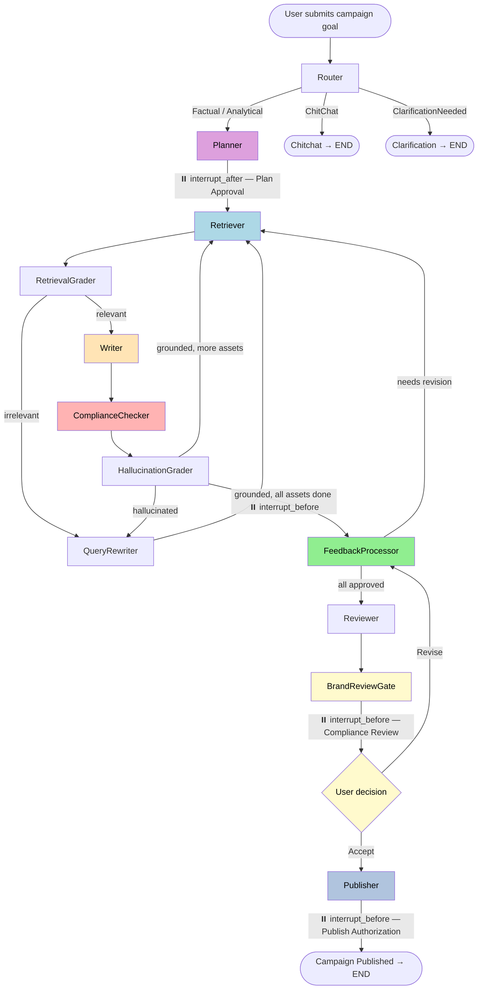

# Agent Specifications — Wealthsimple Marketing Campaign Orchestrator

Full specifications for every node in the LangGraph `StateGraph`. Agents are listed in workflow execution order.

---

## Workflow Overview



**HITL Interrupt Points**
| Interrupt | Type | UI Stage |
|---|---|---|
| After `planner` | `interrupt_after` | Plan Approval |
| Before `feedback_processor` | `interrupt_before` | Draft Review & Feedback |
| Before `brand_review_gate` | `interrupt_before` | Brand Compliance Review |
| Before `publisher` | `interrupt_before` | Publish Authorization |

---

## Agent Specifications

---

### 1. Router
**Position:** Entry point — first node executed
**Role:** Intent classifier — determines whether the goal is a marketing request or a non-actionable query (chitchat, ambiguous)

| | |
|---|---|
| **LLM** | `get_llm(temperature=0)` with structured output (`RouterOutput`) |
| **Prompt** | `ROUTER_PROMPT` |
| **Reads from state** | `goal` |
| **Writes to state** | `intent`, `reasoning_trace` |
| **Tools** | None |
| **HITL** | No |

**Output classes:**
- `Factual` / `Analytical` → routes to **Planner**
- `ChitChat` → routes to **Chitchat** → END
- `ClarificationNeeded` → routes to **Clarification** → END

---

### 2. Planner
**Position:** Second node — runs after Router classifies a marketing intent
**Role:** Senior marketing strategist — builds the campaign asset plan and fetches KPI benchmarks

| | |
|---|---|
| **LLM** | `get_llm(temperature=0)` with structured output (`Plan`) |
| **Prompt** | `PLANNER_PROMPT` |
| **Reads from state** | `goal` |
| **Writes to state** | `plan`, `performance_estimates`, `reasoning_trace` |
| **Tools** | `CampaignPerformanceEstimatorTool` (Pass 2: KPI benchmarks per asset) |
| **HITL** | ⏸️ `interrupt_after=["planner"]` — pauses here for **Plan Approval** |

**Two-pass operation:**
1. **Pass 1** — structured LLM call produces `plan: List[str]` (3–5 asset names)
2. **Pass 2** — iterates each asset and calls `CampaignPerformanceEstimatorTool` to populate `performance_estimates`

**Naming rules enforced by prompt:** each asset must be `"[Channel]: [Specific description with product + audience]"` — e.g. `"Email Campaign: Wealthsimple Invest TFSA Guide for First-Time Investors"`

---

### 3. Retriever
**Position:** Third node — runs per asset in the writing loop
**Role:** RAG retrieval — fetches relevant context from the Wealthsimple knowledge base for the current asset

| | |
|---|---|
| **LLM** | None |
| **Tool** | `RetrieverTool` → `retrieve_context()` → ChromaDB similarity search (top-3 chunks) |
| **Reads from state** | `plan`, `drafts`, `rewritten_query`, `goal`, `current_asset` |
| **Writes to state** | `retrieved_docs`, `current_asset`, `retry_count`, `rewritten_query` |
| **HITL** | No |

**Asset selection logic:** scans `plan` in order and picks the first asset not yet in `drafts`. Resets `retry_count` and `rewritten_query` when switching to a new asset (fresh retrieval per asset).

**Query priority:** uses `rewritten_query` (from Query Rewriter) if available; otherwise constructs `"{current_asset} related to {goal}"`.

---

### 4. Retrieval Grader
**Position:** Fourth node — immediately after Retriever
**Role:** Document relevance validator — determines whether retrieved documents are useful for the current asset

| | |
|---|---|
| **LLM** | `get_llm(temperature=0)` with structured output (`GradeRetrieval`) |
| **Prompt** | `RETRIEVAL_GRADER_PROMPT` |
| **Reads from state** | `rewritten_query` (or `goal`), `retrieved_docs` |
| **Writes to state** | `retrieved_docs_relevant`, `reasoning_trace` |
| **Tools** | Langfuse `track_retrieval_metrics()` (observability side-effect) |
| **HITL** | No |

**Routing decision:**
- `yes` (relevant) → **Writer**
- `no` (irrelevant) AND `retry_count < 1` → **Query Rewriter**
- `no` AND `retry_count >= 1` → **Writer** anyway (best-effort)

---

### 5. Query Rewriter
**Position:** Optional loop node — activated on retrieval failure or hallucination
**Role:** Search query optimizer — rewrites the goal into a precise semantic query for ChromaDB

| | |
|---|---|
| **LLM** | `get_llm(temperature=0)` |
| **Prompt** | `QUERY_REWRITER_PROMPT` |
| **Reads from state** | `goal`, `current_asset` |
| **Writes to state** | `rewritten_query`, `retry_count` (increments) |
| **Tools** | None |
| **HITL** | No |

**Trigger conditions:**
1. Retrieval Grader returns `no` (docs not relevant) on first attempt
2. Hallucination Grader returns `no` (draft hallucinated) on first attempt

Both paths loop back to **Retriever** with the improved query. Max one retry per asset to prevent infinite loops.

---

### 6. Writer
**Position:** Fifth node — core content generation step
**Role:** Marketing copywriter — produces a primary draft for the current asset, runs guardrails, then generates an audience variant

| | |
|---|---|
| **LLM** | `get_llm(temperature=0.7)` (creative mode) |
| **Prompt** | `WRITER_PROMPT` (fresh) or `WRITER_FEEDBACK_PROMPT` (revision with user feedback) |
| **Variant Prompt** | `WRITER_VARIANT_PROMPT` — called in same node to produce variant draft |
| **Reads from state** | `goal`, `plan`, `drafts`, `retrieved_docs`, `user_feedback`, `current_asset` |
| **Writes to state** | `drafts` (adds/replaces current asset), `draft_variants`, `current_asset`, `reasoning_trace` |
| **Tools** | `CompetitorCheck` guardrail (via Guardrails-AI) — redacts competitor names |
| **HITL** | No |

**Three-step operation:**
1. **Draft generation** — uses `WRITER_PROMPT` or `WRITER_FEEDBACK_PROMPT` based on whether feedback exists for this asset
2. **Guardrails validation** — `CompetitorCheck` scans for Questrade, TD Direct Investing, RBC Direct Investing, Nest Wealth, Betterment; redacts any found
3. **Audience variant** — `_detect_audiences()` infers primary + variant audience from asset name/goal keywords, then calls `WRITER_VARIANT_PROMPT` to write an alternative angle

**`_detect_audiences()` keyword map:**

| Keywords | Primary Audience | Variant Audience |
|---|---|---|
| invest, tfsa, rrsp, fhsa, robo | First-Time Investors & Canadians 25–40 | Experienced Investors Optimising Returns |
| trade, commission, etf, tsx, nyse | Self-Directed Investors & Active Traders | First-Time Investors Exploring DIY |
| cash, savings, interest, e-transfer | Everyday Canadians & Young Savers | Millennials Building an Emergency Fund |
| tax, netfile, cra, t4, filing | Canadians Filing Tax Returns | First-Time Filers & New Graduates |
| premium, 100k, 500k, high net worth | Premium & Generation Tier Investors | Aspiring Premium Investors |
| millennial, gen z, young professional | Millennial & Gen Z Canadians | Mid-Career Professionals |
| small business, freelance, corporate | Canadian Small Business Owners | Salaried Professionals |
| *(default)* | Canadians Seeking Financial Freedom | Young Professionals Planning for the Future |

---

### 7. Compliance Checker
**Position:** Sixth node — runs immediately after Writer, before Hallucination Grader
**Role:** Deterministic regulatory scanner — no LLM involved; fast, deterministic, auditable

| | |
|---|---|
| **LLM** | **None** — pure regex |
| **Tool** | `ComplianceCheckerTool` |
| **Reads from state** | `drafts` (all current drafts) |
| **Writes to state** | `compliance_flags`, `compliance_summary` |
| **HITL** | No (flags surface to UI; HIGH flags gate the Approve button) |

**Severity levels:**

| Severity | Behaviour | Example Triggers |
|---|---|---|
| **HIGH → BLOCK** | Approve button disabled until user acknowledges | "guaranteed returns", "risk-free", "100% certain", missing financial disclaimer |
| **MEDIUM → WARN** | Shows warning; publishable with acknowledgement | Unsubstantiated %, unverified superlative, competitor disparagement |
| **LOW / none → PASS** | Green badge | Minor style notes |

**Check categories:** absolute guarantee language, risk-free claims, absolute certainty/reliability claims, financial metrics without disclaimer, unverified superlatives, competitor disparagement, unsubstantiated statistics.

---

### 8. Hallucination Grader
**Position:** Seventh node — after Compliance Checker
**Role:** Grounding validator — ensures the draft is supported by the retrieved documents (not hallucinated)

| | |
|---|---|
| **LLM** | `get_llm(temperature=0)` with structured output (`GradeHallucination`) |
| **Prompt** | `HALLUCINATION_GRADER_PROMPT` |
| **Reads from state** | `retrieved_docs`, `drafts[current_asset]`, `retrieved_docs_relevant`, `retry_count` |
| **Writes to state** | `generation_grounded`, `confidence_scores`, `reasoning_trace` |
| **Tools** | None |
| **HITL** | No |

**Confidence score computation:**

| Condition | Score |
|---|---|
| Retrieved relevant AND grounded | 1.0 (High) |
| Retrieved relevant, NOT grounded | 0.5 (Medium) |
| NOT relevant, but grounded | 0.6 (Medium) |
| NOT relevant AND NOT grounded | 0.2 (Low) |

**Routing decision:**
- Hallucinated AND `retry_count < 1` → **Query Rewriter** (retry with better query)
- Grounded AND more assets in plan → **Retriever** (write next asset)
- Grounded AND all assets drafted → **Feedback Processor** (HITL pause)

---

### 9. Feedback Processor
**Position:** Ninth node — HITL gate after the writing loop
**Role:** Human feedback router — removes drafts marked for revision and prepares the writing loop to regenerate them

| | |
|---|---|
| **LLM** | None |
| **Reads from state** | `draft_status`, `user_feedback`, `drafts`, `langfuse_trace_id` |
| **Writes to state** | `drafts` (removes assets needing revision), `feedback_iteration`, `current_asset` |
| **Tools** | Langfuse `track_user_feedback()` (observability side-effect) |
| **HITL** | ⏸️ `interrupt_before=["feedback_processor"]` — pauses for **Draft Review & Feedback** |

**State injected by UI (via `update_state`) before invoke:**
- `user_feedback: Dict[str, str]` — per-asset revision notes
- `draft_status: Dict[str, str]` — `"approved"` or `"needs_revision"` per asset

**Routing decision:**
- Any `needs_revision` → removes those drafts, sets `current_asset`, routes to **Retriever** (regeneration)
- All approved → routes to **Reviewer**

---

### 10. Reviewer
**Position:** Tenth node — runs after all drafts are approved by the user
**Role:** Brand compliance officer — uses LLM function calling to assess brand voice, tone, and content quality

| | |
|---|---|
| **LLM** | `get_llm(temperature=0)` bound to `ContentQualityTool` (function calling) |
| **Prompt** | `REVIEWER_PROMPT` (fallback) + inline two-round function-calling prompt |
| **Reads from state** | `drafts`, `retrieved_docs` (used as guidelines excerpt) |
| **Writes to state** | `critique` |
| **Tools** | `ContentQualityTool` — deterministic checks: word count, CTA presence, prohibited terms, platform limits, sentence length |
| **HITL** | No (critique shown in `compliance_review` UI stage) |

**Two-round function-calling pattern per asset:**
1. **Round 1** — LLM reads the draft and decides to call `content_quality_analyzer` tool
2. **Round 2** — LLM receives the quality report and writes the final brand compliance verdict

**`ContentQualityTool` checks:**
- Platform character/word limits (email 2000, LinkedIn 3000, Twitter 280, blog 2500, social media 300)
- CTA presence (get started, sign up, learn more, free trial, etc.)
- Prohibited terms and competitor names
- Measurable benefits (numbers/stats present)
- Sentence length ≤ 25 words (Wealthsimple brand guideline)

---

### 11. Brand Review Gate
**Position:** Eleventh node — runs immediately after Reviewer
**Role:** Pure HITL pass-through gate — holds the workflow while the user reviews the brand compliance critique and decides to accept or request revisions

| | |
|---|---|
| **LLM** | None — pure pass-through |
| **Reads from state** | `compliance_revision_requested` (set by UI via `update_state`) |
| **Writes to state** | `{}` (nothing — read-only gate) |
| **Tools** | None |
| **HITL** | ⏸️ `interrupt_before=["brand_review_gate"]` — pauses for **Brand Compliance Review** |

**State injected by UI (via `update_state`) before invoke:**
- `compliance_revision_requested: bool` — `False` to accept, `True` to send for revision
- `user_feedback: Dict[str, str]` — per-asset revision notes (only if revising)
- `draft_status: Dict[str, str]` — `"needs_revision"` for flagged drafts

**Routing decision (`route_after_brand_review_gate`):**
- `compliance_revision_requested = True` → **Feedback Processor** → writing loop → back to Brand Review Gate
- `compliance_revision_requested = False` → **Publisher**

**Double-invoke pattern when revising:**
- Invoke 1: enters `brand_review_gate` → routes to `feedback_processor` → **PAUSE** (interrupt_before)
- Invoke 2: `feedback_processor` runs → writing loop → `reviewer` → back to `brand_review_gate` → **PAUSE** (interrupt_before)

---

### 12. Publisher
**Position:** Final node — runs only after explicit human authorization
**Role:** Campaign executor — creates Google Docs for each draft and schedules publishing dates in Google Calendar

| | |
|---|---|
| **LLM** | None |
| **Reads from state** | `drafts`, `goal` |
| **Writes to state** | `publish_results` |
| **Tools** | `create_doc()` (Google Docs API), `add_calendar_event()` (Google Calendar API) |
| **HITL** | ⏸️ `interrupt_before=["publisher"]` — pauses for **Publish Authorization** |

**Per-asset publishing:**
1. Creates a Google Doc titled `"{asset} - {goal[:30]}"`
2. Schedules a Calendar event `"Publish {asset}"` staggered by day (asset 1 = +1 day, asset 2 = +2 days, etc.)
3. Records `publish_results[asset] = "Doc: {doc_url} | Scheduled: {date}"`

**Fallback behavior:** if Google API credentials are not configured (`GDRIVE_CLIENT_ID` / `GOOGLE_SERVICE_ACCOUNT_INFO`), `create_doc()` returns a mock URL so the rest of the workflow completes without error.

---

### 13. Chitchat *(fallback)*
**Position:** Terminal node — only reached for non-marketing queries
**Role:** Polite response handler for greetings, off-topic questions

| | |
|---|---|
| **LLM** | `get_llm(temperature=0)` |
| **Reads from state** | `goal` |
| **Writes to state** | `critique` |
| **Tools** | None |

---

### 14. Clarification *(fallback)*
**Position:** Terminal node — only reached for ambiguous queries
**Role:** Prompts the user to provide more detail before launching a campaign

| | |
|---|---|
| **LLM** | None — returns a hardcoded clarification message |
| **Reads from state** | *(nothing)* |
| **Writes to state** | `critique` |
| **Tools** | None |

---

## Complete Node Reference Table

| # | Node | LLM? | Tools | HITL? | Reads | Writes |
|---|---|---|---|---|---|---|
| 1 | **Router** | ✅ structured | — | — | `goal` | `intent` |
| 2 | **Planner** | ✅ structured | `CampaignPerformanceEstimatorTool` | ⏸️ interrupt_after | `goal` | `plan`, `performance_estimates` |
| 3 | **Retriever** | — | `RetrieverTool` (ChromaDB) | — | `plan`, `drafts`, `goal` | `retrieved_docs`, `current_asset` |
| 4 | **Retrieval Grader** | ✅ structured | Langfuse metrics | — | `retrieved_docs`, `goal` | `retrieved_docs_relevant` |
| 5 | **Query Rewriter** | ✅ | — | — | `goal`, `current_asset` | `rewritten_query`, `retry_count` |
| 6 | **Writer** | ✅ (×2: draft + variant) | `CompetitorCheck` guardrail | — | `goal`, `retrieved_docs`, `user_feedback` | `drafts`, `draft_variants` |
| 7 | **Compliance Checker** | — (regex only) | `ComplianceCheckerTool` | — | `drafts` | `compliance_flags`, `compliance_summary` |
| 8 | **Hallucination Grader** | ✅ structured | — | — | `retrieved_docs`, `drafts` | `generation_grounded`, `confidence_scores` |
| 9 | **Feedback Processor** | — | Langfuse feedback | ⏸️ interrupt_before | `draft_status`, `user_feedback` | `drafts` (removes), `feedback_iteration` |
| 10 | **Reviewer** | ✅ function calling | `ContentQualityTool` | — | `drafts`, `retrieved_docs` | `critique` |
| 11 | **Brand Review Gate** | — | — | ⏸️ interrupt_before | `compliance_revision_requested` | *(pass-through)* |
| 12 | **Publisher** | — | Google Docs + Calendar API | ⏸️ interrupt_before | `drafts`, `goal` | `publish_results` |
| 13 | **Chitchat** | ✅ | — | — | `goal` | `critique` |
| 14 | **Clarification** | — | — | — | — | `critique` |

---

## AgentState Schema

All nodes communicate exclusively through the `AgentState` TypedDict — no direct inter-agent calls.

```python
class AgentState(TypedDict):
    # ── Core campaign fields ──────────────────────────────────────────────────
    goal: str                              # User's campaign goal (immutable after launch)
    plan: List[str]                        # Asset list from Planner (e.g. ["Email Campaign: ...", ...])
    drafts: Dict[str, str]                 # Per-asset primary draft content
    critique: str                          # Brand compliance review (from Reviewer)
    messages: Annotated[List[BaseMessage], operator.add]  # Accumulated LLM messages
    intent: str                            # Router classification
    retrieved_docs: str                    # RAG context for current asset
    retry_count: int                       # Retrieval/hallucination retry counter (reset per asset)
    reasoning_trace: str                   # Accumulated agent reasoning log
    current_asset: Optional[str]           # Asset currently being written
    errors: List[str]                      # Error accumulator
    publish_results: Dict[str, str]        # Doc URL + schedule per asset

    # ── HITL feedback fields ──────────────────────────────────────────────────
    user_feedback: Dict[str, str]          # Per-asset revision notes from human
    draft_status: Dict[str, str]           # "approved" | "needs_revision" | "pending" per asset
    feedback_iteration: int                # Count of revision cycles

    # ── Quality & routing signals ─────────────────────────────────────────────
    retrieved_docs_relevant: bool          # Retrieval Grader verdict
    generation_grounded: bool             # Hallucination Grader verdict
    rewritten_query: Optional[str]         # Query Rewriter output (overrides raw goal for retrieval)
    confidence_scores: Dict[str, float]    # Per-asset quality score 0.0–1.0

    # ── Compliance Checker ────────────────────────────────────────────────────
    compliance_flags: Dict[str, List[Dict]]  # Per-asset: [{severity, issue, suggestion}]
    compliance_summary: Dict[str, str]       # Per-asset: "PASS" | "WARN" | "BLOCK"
    compliance_acknowledged: bool            # User acknowledged HIGH flags

    # ── Audience Variant Generator ────────────────────────────────────────────
    draft_variants: Dict[str, str]           # Per-asset variant draft (different audience angle)

    # ── Performance Estimator ─────────────────────────────────────────────────
    performance_estimates: Dict[str, Dict]   # Per-asset: {metric: benchmark_value}

    # ── Brand Review Gate ─────────────────────────────────────────────────────
    compliance_revision_requested: Optional[bool]  # None=undecided, False=accept, True=revise
    compliance_revision_notes: Dict[str, str]       # Per-asset brand review revision notes

    # ── Observability ─────────────────────────────────────────────────────────
    langfuse_trace_id: Optional[str]         # Langfuse trace ID for the current campaign run
```

---

## Routing Logic Summary

| Source Node | Condition | Destination |
|---|---|---|
| Router | `intent` = Factual / Analytical | Planner |
| Router | `intent` = ChitChat | Chitchat → END |
| Router | `intent` = ClarificationNeeded | Clarification → END |
| Planner | *(always)* | Retriever |
| Retriever | *(always)* | Retrieval Grader |
| Retrieval Grader | `retrieved_docs_relevant = True` | Writer |
| Retrieval Grader | `False` AND `retry_count < 1` | Query Rewriter |
| Retrieval Grader | `False` AND `retry_count >= 1` | Writer (best-effort) |
| Query Rewriter | *(always)* | Retriever |
| Writer | *(always)* | Compliance Checker |
| Compliance Checker | *(always)* | Hallucination Grader |
| Hallucination Grader | Hallucinated AND `retry_count < 1` | Query Rewriter |
| Hallucination Grader | Grounded AND `len(drafts) < len(plan)` | Retriever |
| Hallucination Grader | Grounded AND all assets drafted | Feedback Processor |
| Feedback Processor | Any `needs_revision` | Retriever |
| Feedback Processor | All approved | Reviewer |
| Reviewer | *(always)* | Brand Review Gate |
| Brand Review Gate | `compliance_revision_requested = True` | Feedback Processor |
| Brand Review Gate | `compliance_revision_requested = False` | Publisher |
| Publisher | *(always)* | END |
