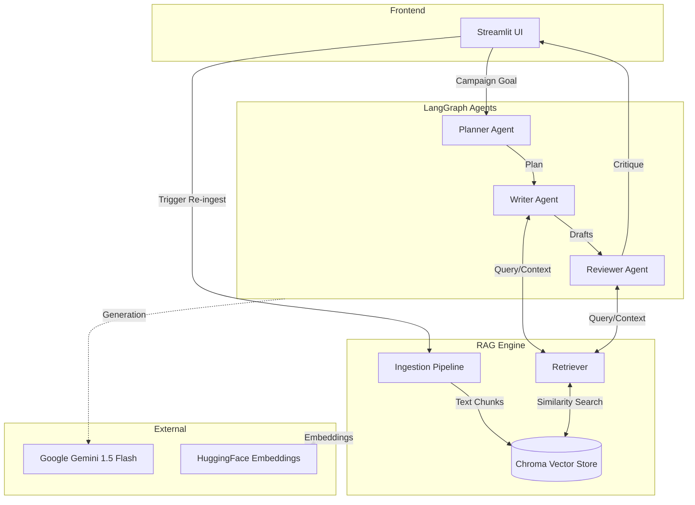
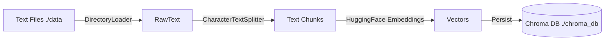
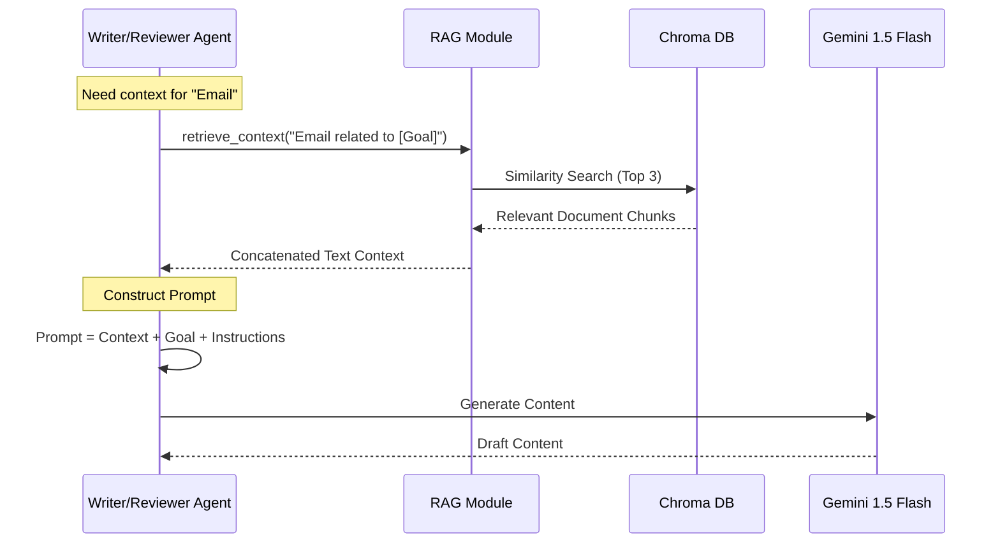

# RAG Architecture & Flow

This document details the architecture of the Retrieval-Augmented Generation (RAG) system used in the Marketing Campaign Orchestrator.

## 1. High-Level System Architecture

The system consists of three main layers:
1.  **Frontend**: Streamlit UI for user interaction.
2.  **Orchestration**: LangGraph managing the state and agent workflow.
3.  **RAG Engine**: Handles document ingestion, embedding, and retrieval.

## 2. RAG Data Flow

The RAG process is split into two distinct flows: Ingestion (Offline/Setup) and Inference (Runtime).

### A. Ingestion Flow (Knowledge Base Creation)
This process loads raw text data and converts it into a machine-searchable vector format.

1.  **Load**: `DirectoryLoader` reads `*.txt` files from `./data`.
2.  **Split**: `CharacterTextSplitter` chunks text (size: 1000, overlap: 0).
3.  **Embed**: `all-MiniLM-L6-v2` converts chunks into vector embeddings.
4.  **Store**: Vectors are saved locally to `./chroma_db`.

### B. Inference Flow (Agentic Execution)
How agents use the RAG system to generate content.

## 3. Technology Stack

| Component | Technology | Implementation |
| :--- | :--- | :--- |
| **LLM** | Google Gemini | `gemini-1.5-flash` |
| **Embeddings** | Hugging Face | `all-MiniLM-L6-v2` |
| **Vector Store** | ChromaDB | Local Persistence (`./chroma_db`) |
| **Orchestrator** | LangGraph | StateGraph with Checkpointing |
| **Framework** | LangChain | `langchain_google_genai`, `langchain_chroma` |
