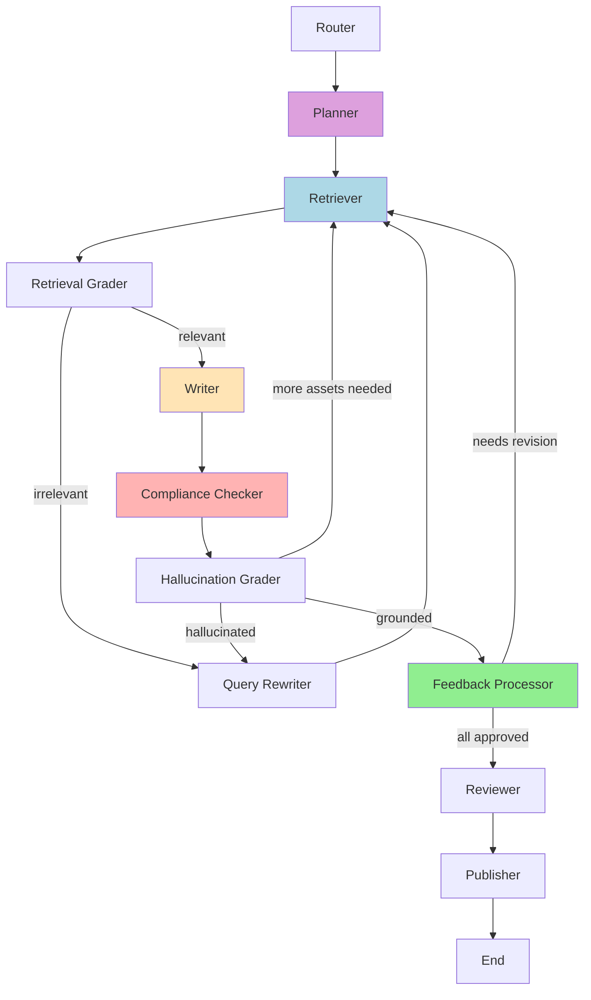
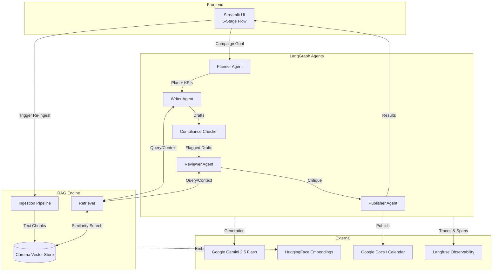
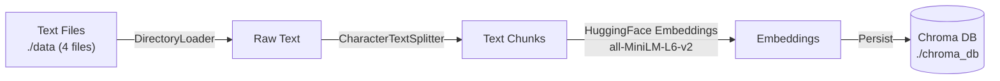
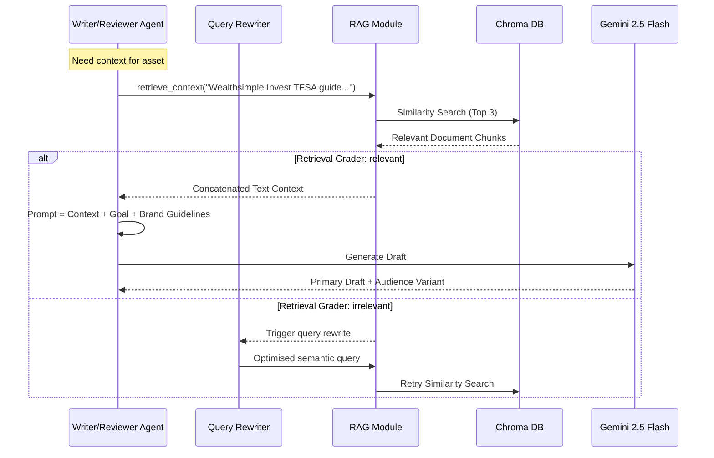

# RAG Architecture & Flow

This document details the architecture of the Retrieval-Augmented Generation (RAG) system used in the Wealthsimple Marketing Campaign Orchestrator.

## 0. Complete Agent Workflow with Human-in-the-Loop

The following diagram shows the full agent workflow including all nodes added through March 2026:


```mermaid
graph TD
    Router[Router] --> Planner[Planner]
    Planner --> Retriever[Retriever]
    Retriever --> RetrievalGrader[Retrieval Grader]

    RetrievalGrader -->|relevant| Writer[Writer]
    RetrievalGrader -->|irrelevant| QueryRewriter[Query Rewriter]

    QueryRewriter --> Retriever

    Writer --> ComplianceChecker[Compliance Checker]

    ComplianceChecker --> HallucinationGrader[Hallucination Grader]

    HallucinationGrader -->|grounded| FeedbackProcessor[Feedback Processor]
    HallucinationGrader -->|hallucinated| QueryRewriter
    HallucinationGrader -->|more assets needed| Retriever

    FeedbackProcessor -->|needs revision| Retriever
    FeedbackProcessor -->|all approved| Reviewer[Reviewer]

    Reviewer --> Publisher[Publisher]
    Publisher --> End[End]

    style ComplianceChecker fill:#FFB3B3
    style FeedbackProcessor fill:#90EE90
    style Writer fill:#FFE4B5
    style Retriever fill:#ADD8E6
    style Planner fill:#DDA0DD
```

**Workflow Nodes:**
- **Router**: Classifies user intent (Factual / Analytical / ChitChat / ClarificationNeeded)
- **Planner**: Determines which marketing assets to create; calls `CampaignPerformanceEstimatorTool` for KPI benchmarks
- **Retriever** ⏸️ *(HITL interrupt)*: Fetches relevant context from the Wealthsimple knowledge base (RAG)
- **Retrieval Grader**: Validates relevance of retrieved documents; triggers Query Rewriter on failure
- **Query Rewriter**: Rewrites the goal into a focused semantic search query when retrieval fails
- **Writer**: Generates primary draft (with CompetitorCheck guardrail) + audience variant via `_detect_audiences()`
- **Compliance Checker** ⭐ NEW: Deterministic regex-based check (no LLM); flags BLOCK / WARN / PASS; HIGH flags gate the Approve button
- **Hallucination Grader**: Ensures content is grounded in retrieved documents
- **Feedback Processor** ⏸️ *(HITL interrupt)*: Handles human feedback; routes to Retriever for revision or Reviewer if all approved
- **Reviewer**: Checks brand compliance against Wealthsimple guidelines
- **Publisher** ⏸️ *(HITL interrupt)*: Creates Google Docs and schedules Calendar events

**Human-in-the-Loop Interrupt Points:**
The workflow pauses at three nodes (`interrupt_before=["retriever", "feedback_processor", "publisher"]`), keeping humans in control of key decisions: plan approval, draft review, and final publish authorization.

---

## 1. High-Level System Architecture

The system consists of four main layers:
1. **Frontend**: Streamlit UI for user interaction (5 stages)
2. **Orchestration**: LangGraph `StateGraph` managing agent workflow and checkpointing
3. **RAG Engine**: Document ingestion, embedding, and retrieval
4. **Observability**: Langfuse tracing for all LLM calls and human decisions


```mermaid
graph TD
    subgraph Frontend
        UI[Streamlit UI\n5-Stage Flow]
    end

    subgraph Agents [LangGraph Agents]
        Planner[Planner Agent]
        Writer[Writer Agent]
        Compliance[Compliance Checker]
        Reviewer[Reviewer Agent]
        Publisher[Publisher Agent]
    end

    subgraph RAG [RAG Engine]
        Ingest[Ingestion Pipeline]
        VectorDB[(Chroma Vector Store)]
        Retriever[Retriever]
    end

    subgraph External
        Google[Google Gemini 2.5 Flash]
        HF[HuggingFace Embeddings]
        GDocs[Google Docs / Calendar]
        Langfuse[Langfuse Observability]
    end

    UI -->|Campaign Goal| Planner
    UI -->|Trigger Re-ingest| Ingest

    Planner -->|Plan + KPIs| Writer
    Writer -->|Drafts| Compliance
    Compliance -->|Flagged Drafts| Reviewer
    Reviewer -->|Critique| Publisher
    Publisher -->|Results| UI

    Writer <-->|Query/Context| Retriever
    Reviewer <-->|Query/Context| Retriever

    Ingest -->|Text Chunks| VectorDB
    Retriever <-->|Similarity Search| VectorDB

    Agents -.->|Generation| Google
    RAG -.->|Embeddings| HF
    Publisher -.->|Publish| GDocs
    Agents -.->|Traces & Spans| Langfuse
```

---

## 2. Streamlit UI Flow (5 Stages)

```
Stage 1: entry              → Define Campaign Goal (Goal Builder or Free Text)
                               Quick-start templates: Wealthsimple Invest / Trade / Cash / Tax
Stage 2: plan_approval      → Review strategic plan + KPI benchmark table
                               ⏸️ HUMAN DECISION: Approve Plan
Stage 3: draft_approval     → Preview all drafts with compliance badges
                               Tabbed view: Primary Audience | Variant Segment
                               HIGH compliance flags require acknowledgement checkbox
                               ⏸️ HUMAN DECISION: Quick Publish or Continue to Feedback
Stage 3b: feedback_collection → Approve or request revision per draft
                               Iterative loop: revised drafts re-enter Retriever → Writer
                               ⏸️ HUMAN DECISION: Approve / Revise each draft
Stage 4: review_approval    → Final brand compliance review; export campaign brief
                               ⏸️ HUMAN DECISION: Authorize & Publish to Google Workspace
Stage 5: complete           → Publishing results + audit trail download
```

---

## 3. RAG Data Flow

### A. Ingestion Flow (Knowledge Base Creation)

Triggered by the "Re-ingest Knowledge Base" button in the sidebar. Loads all Wealthsimple knowledge base files.

```
data/
├── brand_guidelines.txt         — Wealthsimple brand voice, prohibited terms, competitors
├── product_catalog.txt          — Wealthsimple Invest, Trade, Cash, Tax details
├── customer_success_stories.txt — Anonymised user personas (Priya, Marcus, Danielle)
└── compliance_guidelines.txt    — CIRO, OSC, CSA, FINTRAC, NI 31-103, CIPF requirements
```

1. **Load**: `DirectoryLoader` reads `*.txt` files from `./data`
2. **Split**: `CharacterTextSplitter` chunks text (size: 1000, overlap: 0)
3. **Embed**: `all-MiniLM-L6-v2` converts chunks into vector embeddings
4. **Store**: Vectors are persisted locally to `./chroma_db`


```mermaid
flowchart LR
    Docs["Text Files\n./data (4 files)"] -->|DirectoryLoader| RawText[Raw Text]
    RawText -->|CharacterTextSplitter| Chunks[Text Chunks]
    Chunks -->|HuggingFace Embeddings\nall-MiniLM-L6-v2| Vectors[Embeddings]
    Vectors -->|Persist| DB[(Chroma DB\n./chroma_db)]
```

### B. Inference Flow (Agentic Execution)

How agents use the RAG system to generate Wealthsimple-branded content.


```mermaid
sequenceDiagram
    participant Agent as Writer/Reviewer Agent
    participant QR as Query Rewriter
    participant Rag as RAG Module
    participant DB as Chroma DB
    participant LLM as Gemini 2.5 Flash

    Note over Agent: Need context for asset
    Agent->>Rag: retrieve_context("Wealthsimple Invest TFSA guide...")
    Rag->>DB: Similarity Search (Top 3)
    DB-->>Rag: Relevant Document Chunks

    alt Retrieval Grader: relevant
        Rag-->>Agent: Concatenated Text Context
        Agent->>Agent: Prompt = Context + Goal + Brand Guidelines
        Agent->>LLM: Generate Draft
        LLM-->>Agent: Primary Draft + Audience Variant
    else Retrieval Grader: irrelevant
        Rag-->>QR: Trigger query rewrite
        QR->>Rag: Optimised semantic query
        Rag->>DB: Retry Similarity Search
    end
```

---

## 4. New Features (March 2026)

### Compliance Checker Node
- Runs **after Writer, before Hallucination Grader**
- Uses deterministic regex patterns from `ComplianceCheckerTool` — no LLM call, fast and deterministic
- Severity levels: **BLOCK** (HIGH flags), **WARN** (MEDIUM flags), **PASS**
- HIGH flags disable the Approve button in the UI until the user checks an acknowledgement checkbox
- Checks include: guaranteed-return language, missing financial disclaimers, competitor disparagement, unverified superlatives

### Audience Variant Generator
- Writer node detects target audiences via `_detect_audiences()` and calls `WRITER_VARIANT_PROMPT`
- Each draft is shown in a tabbed UI: `🎯 Primary Audience` | `👥 Variant Segment`
- Available in: `draft_approval`, `feedback_collection`, and `review_approval` stages

### Performance Estimator
- Planner calls `CampaignPerformanceEstimatorTool` for each planned asset
- KPI benchmark table rendered in `plan_approval` stage via `st.dataframe`
- Industry benchmarks: email open rates, CTR, blog traffic estimates, etc.
- Disclaimer: "Industry benchmarks. Individual results may vary."

### Langfuse Observability
- Enabled via `LANGFUSE_PUBLIC_KEY` + `LANGFUSE_SECRET_KEY` in `.env`
- Tracks: full workflow traces, per-node spans, human feedback scores, guardrail results, retrieval metrics
- Sidebar shows live trace URL when a campaign is running

---

## 5. Technology Stack

| Component | Technology | Details |
| :--- | :--- | :--- |
| **LLM** | Google Gemini | `gemini-2.5-flash` |
| **Embeddings** | Hugging Face | `all-MiniLM-L6-v2` |
| **Vector Store** | ChromaDB | Local persistence (`./chroma_db`) |
| **Orchestrator** | LangGraph | `StateGraph` with interrupt checkpointing |
| **Framework** | LangChain | `langchain_google_genai`, `langchain_chroma` |
| **Frontend** | Streamlit | 5-stage HITL workflow |
| **Observability** | Langfuse | Traces, spans, feedback scoring |
| **Publishing** | Google Docs + Calendar | Direct API + optional MCP fallback |
| **Guardrails** | Custom regex + Guardrails-AI | `ComplianceCheckerTool`, `CompetitorCheckTool` |
