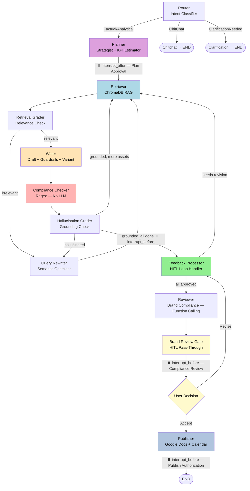
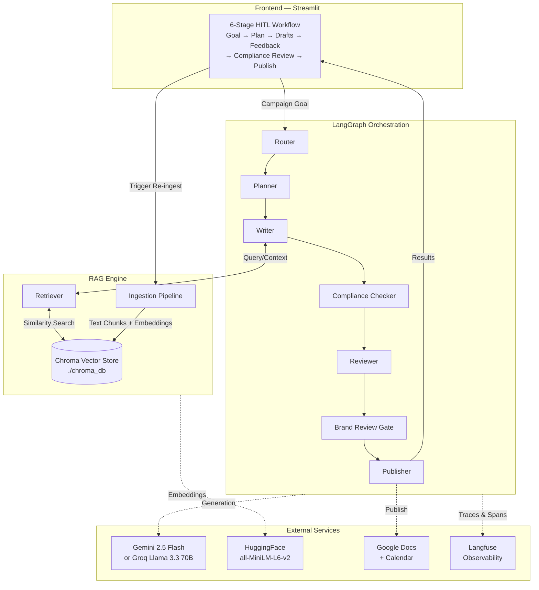
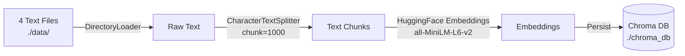
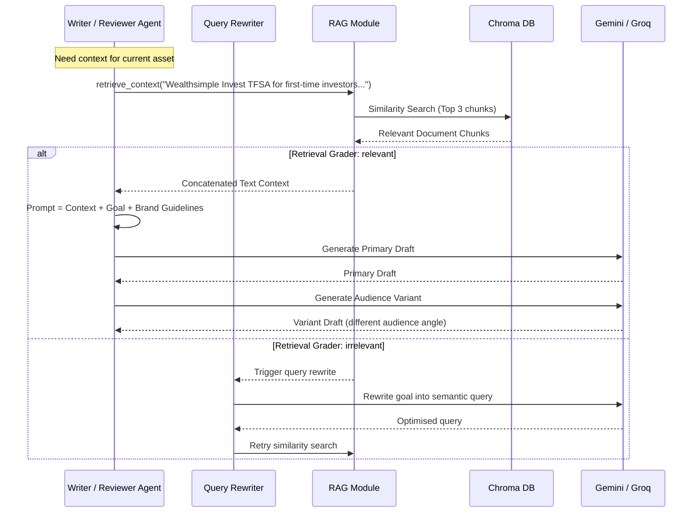

# RAG Architecture & Flow

This document details the architecture of the Retrieval-Augmented Generation (RAG) system used in the Wealthsimple Marketing Campaign Orchestrator.

---

## 0. Complete Agent Workflow with Human-in-the-Loop

The following diagram shows the full agent workflow including all 14 nodes and 4 HITL interrupt points.


```mermaid
graph TD
    Router[Router\nIntent Classifier] -->|Factual/Analytical| Planner[Planner\nStrategist + KPI Estimator]
    Router -->|ChitChat| Chitchat([Chitchat → END])
    Router -->|ClarificationNeeded| Clarification([Clarification → END])

    Planner -->|"⏸️ interrupt_after — Plan Approval"| Retriever

    Retriever[Retriever\nChromaDB RAG] --> RetrievalGrader[Retrieval Grader\nRelevance Check]

    RetrievalGrader -->|relevant| Writer[Writer\nDraft + Guardrails + Variant]
    RetrievalGrader -->|irrelevant| QueryRewriter[Query Rewriter\nSemantic Optimiser]

    QueryRewriter --> Retriever

    Writer --> ComplianceChecker[Compliance Checker\nRegex — No LLM]
    ComplianceChecker --> HallucinationGrader[Hallucination Grader\nGrounding Check]

    HallucinationGrader -->|hallucinated| QueryRewriter
    HallucinationGrader -->|grounded, more assets| Retriever
    HallucinationGrader -->|"grounded, all done ⏸️ interrupt_before"| FeedbackProcessor[Feedback Processor\nHITL Loop Handler]

    FeedbackProcessor -->|needs revision| Retriever
    FeedbackProcessor -->|all approved| Reviewer[Reviewer\nBrand Compliance — Function Calling]

    Reviewer --> BrandReviewGate[Brand Review Gate\nHITL Pass-Through]

    BrandReviewGate -->|"⏸️ interrupt_before — Compliance Review"| BrandDecision{User Decision}
    BrandDecision -->|Accept| Publisher[Publisher\nGoogle Docs + Calendar]
    BrandDecision -->|Revise| FeedbackProcessor

    Publisher -->|"⏸️ interrupt_before — Publish Authorization"| End([END])

    style Planner         fill:#DDA0DD,color:#000
    style Retriever       fill:#ADD8E6,color:#000
    style Writer          fill:#FFE4B5,color:#000
    style ComplianceChecker fill:#FFB3B3,color:#000
    style FeedbackProcessor fill:#90EE90,color:#000
    style BrandReviewGate fill:#FFFACD,color:#000
    style Publisher       fill:#B0C4DE,color:#000
    style BrandDecision   fill:#FFFACD,color:#000
```

**Node Summary:**

| Node | Role | LLM? | HITL? |
|---|---|---|---|
| **Router** | Classifies intent (Factual / Analytical / ChitChat / ClarificationNeeded) | ✅ structured | — |
| **Planner** | Builds asset plan (3–5 items); calls `CampaignPerformanceEstimatorTool` for KPI benchmarks | ✅ structured | ⏸️ interrupt_after |
| **Retriever** | ChromaDB similarity search (top-3 chunks) for the current asset | — | — |
| **Retrieval Grader** | Validates relevance of retrieved documents; triggers Query Rewriter on failure | ✅ structured | — |
| **Query Rewriter** | Rewrites goal into a focused semantic query when retrieval fails or draft hallucinates | ✅ | — |
| **Writer** | Generates primary draft (+ CompetitorCheck guardrail) + audience variant | ✅ ×2 | — |
| **Compliance Checker** | Deterministic regex scan: BLOCK / WARN / PASS — no LLM, fast and auditable | — | — |
| **Hallucination Grader** | Verifies draft is grounded in retrieved documents; computes confidence score | ✅ structured | — |
| **Feedback Processor** | Removes drafts needing revision, re-triggers writing loop; logs to Langfuse | — | ⏸️ interrupt_before |
| **Reviewer** | Brand compliance via LLM function calling + `ContentQualityTool` | ✅ function calling | — |
| **Brand Review Gate** | HITL pass-through — pauses for user to accept or request brand review revisions | — | ⏸️ interrupt_before |
| **Publisher** | Creates Google Docs + schedules Calendar events per draft | — | ⏸️ interrupt_before |
| **Chitchat** | Handles off-topic queries politely | ✅ | — |
| **Clarification** | Prompts user to provide more detail for ambiguous goals | — | — |

**LangGraph compile settings:**
```python
workflow.compile(
    checkpointer=MemorySaver(),
    interrupt_after=["planner"],                                           # Plan approval pause
    interrupt_before=["feedback_processor", "brand_review_gate", "publisher"],  # 3 human gates
)
```

---

## 1. High-Level System Architecture

The system consists of four main layers:
1. **Frontend**: Streamlit UI for user interaction (6 stages)
2. **Orchestration**: LangGraph `StateGraph` managing agent workflow and HITL checkpointing
3. **RAG Engine**: Document ingestion, embedding, and retrieval
4. **Observability**: Langfuse tracing for all LLM calls and human decisions


```mermaid
graph TD
    subgraph Frontend[Frontend — Streamlit]
        UI["6-Stage HITL Workflow\nGoal → Plan → Drafts → Feedback\n→ Compliance Review → Publish"]
    end

    subgraph Orchestration[LangGraph Orchestration]
        Router2[Router]
        Planner2[Planner]
        Writer2[Writer]
        Compliance2[Compliance Checker]
        Reviewer2[Reviewer]
        BRG[Brand Review Gate]
        Publisher2[Publisher]
    end

    subgraph RAG[RAG Engine]
        Ingest[Ingestion Pipeline]
        VectorDB[(Chroma Vector Store\n./chroma_db)]
        Retriever2[Retriever]
    end

    subgraph External[External Services]
        LLM2[Gemini 2.5 Flash\nor Groq Llama 3.3 70B]
        HF[HuggingFace\nall-MiniLM-L6-v2]
        GDocs[Google Docs\n+ Calendar]
        Langfuse2[Langfuse\nObservability]
    end

    UI -->|Campaign Goal| Router2
    UI -->|Trigger Re-ingest| Ingest

    Router2 --> Planner2
    Planner2 --> Writer2
    Writer2 --> Compliance2
    Compliance2 --> Reviewer2
    Reviewer2 --> BRG
    BRG --> Publisher2
    Publisher2 -->|Results| UI

    Writer2 <-->|Query/Context| Retriever2
    Retriever2 <-->|Similarity Search| VectorDB
    Ingest -->|Text Chunks + Embeddings| VectorDB

    Orchestration -.->|Generation| LLM2
    RAG -.->|Embeddings| HF
    Publisher2 -.->|Publish| GDocs
    Orchestration -.->|Traces & Spans| Langfuse2
```

---

## 2. Streamlit UI Flow (6 Stages)

```
Stage 1 — entry
    Define Campaign Goal
    Quick-start templates: 💰 Invest / 📈 Trade / 🏦 Cash / 🇨🇦 Tax Season
    Goal Builder (guided fields) or Free Text (advanced)
    Goal Quality Meter (0–100%) + Composed Goal Preview

Stage 2 — plan_approval                              ⏸️ HUMAN DECISION
    Review AI-generated asset plan (3–5 assets)
    KPI Benchmark Table (industry benchmarks per asset type)
    → Approve Plan & Start Drafting | ↩ Redefine Goal

Stage 3 — draft_approval
    Preview all drafts with compliance badges (✅ PASS / ⚠️ WARN / 🚫 BLOCK)
    Tabbed view: 🎯 Primary Audience | 👥 Variant Segment
    HIGH compliance flags require acknowledgement checkbox before proceeding
    Campaign Readiness Score (avg confidence across assets)
    → Quick Publish to Google Docs | → Continue to Detailed Review & Feedback

Stage 3b — feedback_collection                       ⏸️ HUMAN DECISION
    Per-draft Approve (✅) or Revise (🔄) with revision notes
    Bulk Approve All option
    Rejected drafts loop back through Retriever → Writer → Compliance → Hallucination Grader
    → Submit & Continue (to Brand Compliance Review)

Stage 4 — compliance_review                          ⏸️ HUMAN DECISION
    Full Brand Compliance Assessment (from Reviewer — function calling)
    Per-draft radio: ✅ Accept as-is | 🔄 Revise based on review
    Accept → publisher stage | Revise → double-invoke regeneration loop → back to Stage 4
    Audit log records every decision

Stage 5 — review_approval                            ⏸️ HUMAN DECISION
    Final Publish Authorization
    Full draft display with critique
    Export Campaign Brief (.md download)
    → Authorize & Publish to Google Workspace

Stage 6 — complete
    Publishing results (Google Doc URLs + scheduled dates)
    Human Decision Audit Trail
    Reset for new campaign
```

---

## 3. RAG Data Flow

### A. Ingestion Flow (Knowledge Base Creation)

Triggered by the "Re-ingest Knowledge Base" button in the sidebar. Loads all 4 Wealthsimple knowledge base files.

```
data/
├── brand_guidelines.txt          — Wealthsimple brand voice, tone rules, prohibited terms, competitor list
├── product_catalog.txt           — Wealthsimple Invest, Trade, Cash, Tax: fees, features, target audiences
├── customer_success_stories.txt  — Anonymised user personas: Priya (Invest), Marcus (Trade), Danielle (Tax)
└── compliance_guidelines.txt     — CIRO, OSC, CSA, FINTRAC, NI 31-103, CIPF, CASL requirements
```

1. **Load**: `DirectoryLoader` reads `*.txt` files from `./data`
2. **Split**: `CharacterTextSplitter` chunks text (size: 1000, overlap: 0)
3. **Embed**: `all-MiniLM-L6-v2` converts chunks into vector embeddings
4. **Store**: Vectors are persisted locally to `./chroma_db`


```mermaid
flowchart LR
    Docs["4 Text Files\n./data/"] -->|DirectoryLoader| RawText[Raw Text]
    RawText -->|CharacterTextSplitter\nchunk=1000| Chunks[Text Chunks]
    Chunks -->|HuggingFace Embeddings\nall-MiniLM-L6-v2| Vectors[Embeddings]
    Vectors -->|Persist| DB[(Chroma DB\n./chroma_db)]
```

### B. Inference Flow (Agentic Execution)

How agents use the RAG system during a live campaign run.


```mermaid
sequenceDiagram
    participant Agent as Writer / Reviewer Agent
    participant QR as Query Rewriter
    participant Rag as RAG Module
    participant DB as Chroma DB
    participant LLM as Gemini / Groq

    Note over Agent: Need context for current asset
    Agent->>Rag: retrieve_context("Wealthsimple Invest TFSA for first-time investors...")
    Rag->>DB: Similarity Search (Top 3 chunks)
    DB-->>Rag: Relevant Document Chunks

    alt Retrieval Grader: relevant
        Rag-->>Agent: Concatenated Text Context
        Agent->>Agent: Prompt = Context + Goal + Brand Guidelines
        Agent->>LLM: Generate Primary Draft
        LLM-->>Agent: Primary Draft
        Agent->>LLM: Generate Audience Variant
        LLM-->>Agent: Variant Draft (different audience angle)
    else Retrieval Grader: irrelevant
        Rag-->>QR: Trigger query rewrite
        QR->>LLM: Rewrite goal into semantic query
        LLM-->>QR: Optimised query
        QR->>Rag: Retry similarity search
    end
```

---

## 4. Feature Details

### Compliance Checker Node
- Runs **after Writer, before Hallucination Grader**
- Uses deterministic regex patterns from `ComplianceCheckerTool` — no LLM, fast and auditable
- Severity levels: **BLOCK** (HIGH), **WARN** (MEDIUM), **PASS**
- HIGH flags disable the Approve button in `draft_approval` until user checks an acknowledgement checkbox
- Checks: guaranteed-return language, risk-free claims, absolute certainty claims, financial metrics without disclaimer, unverified superlatives, competitor disparagement, unsubstantiated statistics

### Audience Variant Generator
- Writer node calls `_detect_audiences(asset_name, goal)` to infer primary + variant audience segments from keywords
- Calls `WRITER_VARIANT_PROMPT` as a second LLM pass in the same `writer_node` execution
- Both drafts shown in tabbed UI (`🎯 Primary Audience` | `👥 Variant Segment`) across `draft_approval`, `feedback_collection`, and `compliance_review` stages

### Performance Estimator
- Planner calls `CampaignPerformanceEstimatorTool` for each planned asset immediately after building the plan (Pass 2)
- KPI benchmark table rendered in `plan_approval` stage via `st.dataframe`
- Benchmarks sourced from: HubSpot 2025, Mailchimp, LinkedIn Marketing Solutions, CMI 2025, Sprout Social Index 2025, WordStream

### Brand Review Gate
- Added after the `reviewer` node to create an explicit HITL checkpoint before publishing
- Graph pauses `interrupt_before=["brand_review_gate"]` — UI shows the full brand compliance critique
- User can accept all drafts (→ publisher) or flag specific drafts for revision (→ feedback_processor → full writing loop → reviewer → brand_review_gate again)
- Double-invoke pattern: Invoke 1 enters gate → routes to feedback_processor → PAUSE; Invoke 2 runs feedback_processor → writing loop → back to gate → PAUSE

### Langfuse Observability
- Enabled via `LANGFUSE_PUBLIC_KEY` + `LANGFUSE_SECRET_KEY` in `.env`
- Tracks: full workflow traces, per-node spans, human feedback scores, guardrail results, retrieval relevance metrics
- Sidebar shows live trace URL when a campaign is running

---

## 5. Technology Stack

| Component | Technology | Details |
| :--- | :--- | :--- |
| **LLM (default)** | Google Gemini | `gemini-2.5-flash` |
| **LLM (alt)** | Groq | `llama-3.3-70b-versatile` — higher free-tier rate limits |
| **LLM Provider** | `get_llm()` factory | Switchable via `LLM_PROVIDER=groq` in `.env` |
| **Embeddings** | Hugging Face | `all-MiniLM-L6-v2` |
| **Vector Store** | ChromaDB | Local persistence (`./chroma_db`) |
| **Orchestrator** | LangGraph | `StateGraph` with `MemorySaver` HITL checkpointing |
| **Framework** | LangChain | `langchain_google_genai`, `langchain_groq`, `langchain_chroma` |
| **Frontend** | Streamlit | 6-stage HITL workflow |
| **Observability** | Langfuse | Traces, spans, feedback scoring, retrieval metrics |
| **Publishing** | Google Docs + Calendar | Direct API + optional MCP fallback |
| **Guardrails** | Custom regex + Guardrails-AI | `ComplianceCheckerTool` (regulatory), `CompetitorCheck` (brand) |
| **Compliance** | Deterministic regex | CIRO, OSC, CSA, FINTRAC, NI 31-103, CIPF, CASL coverage |
