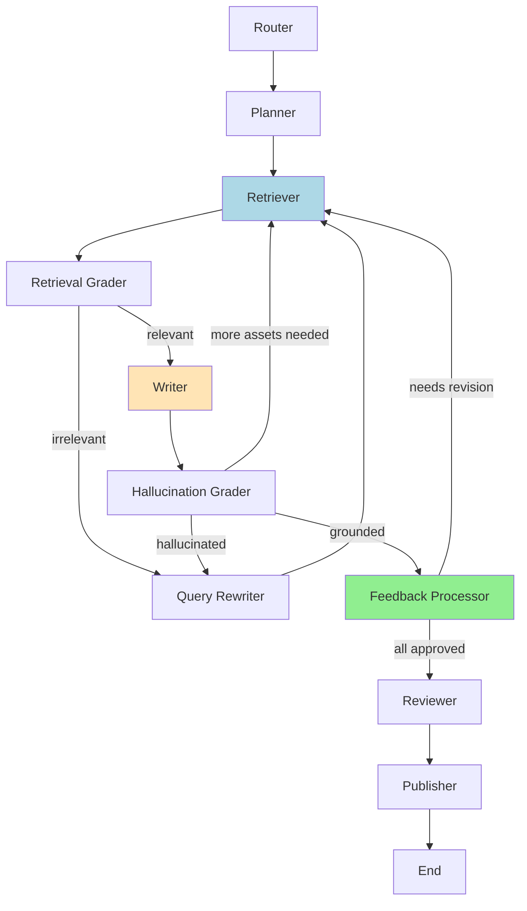

# RAG Architecture & Flow

This document details the architecture of the Retrieval-Augmented Generation (RAG) system used in the Marketing Campaign Orchestrator.

## 0. Complete Agent Workflow with Human-in-the-Loop

The following diagram shows the full agent workflow including the new **Feedback Processor** node for human-in-the-loop functionality:

**Workflow Nodes:**
- **Router**: Classifies user intent (marketing campaign vs chitchat)
- **Planner**: Determines which marketing assets to create
- **Retriever**: Fetches relevant context from knowledge base (RAG)
- **Retrieval Grader**: Validates relevance of retrieved documents
- **Writer**: Generates content using RAG-retrieved context
- **Hallucination Grader**: Ensures content is grounded in retrieved context
- **Feedback Processor** ⭐ NEW ⭐: Handles human feedback and triggers regeneration
- **Reviewer**: Checks brand compliance against guidelines
- **Publisher**: Creates Google Docs and schedules calendar events

**Human-in-the-Loop**: The workflow pauses at the Feedback Processor, allowing users to review drafts, provide feedback, and request revisions. Rejected drafts are regenerated incorporating user feedback.

## 1. High-Level System Architecture

The system consists of three main layers:
1.  **Frontend**: Streamlit UI for user interaction.
2.  **Orchestration**: LangGraph managing the state and agent workflow.
3.  **RAG Engine**: Handles document ingestion, embedding, and retrieval.

## 2. RAG Data Flow

Step 1: Plan Approval
  ↓
Step 2: Review Drafts (Preview)
  ↓
Step 3: Provide Feedback ⭐ NEW ⭐
  ├─ Approve Individual Drafts
  ├─ Request Revisions with Feedback
  ├─ View Status Metrics
  └─ Submit Feedback
        ├─ If revisions needed → Regenerate → Back to Step 3
        └─ If all approved → Continue
  ↓
Step 4: Final Review
  ↓
Step 5: Publish

The RAG process is split into two distinct flows: Ingestion (Offline/Setup) and Inference (Runtime).

### A. Ingestion Flow (Knowledge Base Creation)
This process loads raw text data and converts it into a machine-searchable vector format.

1.  **Load**: `DirectoryLoader` reads `*.txt` files from `./data`.
2.  **Split**: `CharacterTextSplitter` chunks text (size: 1000, overlap: 0).
3.  **Embed**: `all-MiniLM-L6-v2` converts chunks into vector embeddings.
4.  **Store**: Vectors are saved locally to `./chroma_db`.

### B. Inference Flow (Agentic Execution)
How agents use the RAG system to generate content.

## 3. Technology Stack

| Component | Technology | Implementation |
| :--- | :--- | :--- |
| **LLM** | Google Gemini | `gemini-1.5-flash` |
| **Embeddings** | Hugging Face | `all-MiniLM-L6-v2` |
| **Vector Store** | ChromaDB | Local Persistence (`./chroma_db`) |
| **Orchestrator** | LangGraph | StateGraph with Checkpointing |
| **Framework** | LangChain | `langchain_google_genai`, `langchain_chroma` |
